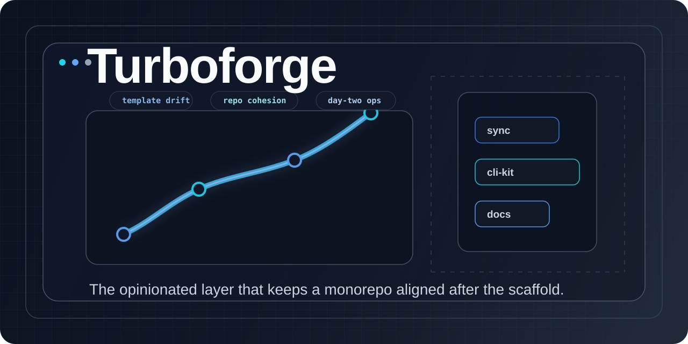

# Turboforge



Turboforge is a monorepo operating system for teams that want a strong default stack without freezing their codebase in a starter template.

Most monorepos start clean and get messy fast. The template drifts. Package conventions split. Release tooling forks. Docs become a side project. Turboforge gives you a way to keep the repo opinionated after day one, not just at scaffold time.

## The Problem

Turborepo solves task orchestration. It does not tell you how your repo should evolve.

Templates solve day-zero setup. They do not help when the template improves next month and your repo has already diverged.

Custom scripts solve the immediate problem in front of you. They usually become one-off glue that only one person understands.

That leaves most teams with the same failure mode:

- a good starting point
- slow drift across packages
- duplicated CLI logic
- manual upgrade work
- docs and tooling that stop feeling like one system

Turboforge exists to close that gap.

## The Solution

Turboforge gives you a maintainable path from "we have a monorepo" to "we have a coherent engineering system."

It does that with a small set of focused building blocks:

- a sync engine for pulling upstream template changes into a real, already-customized repo
- a monorepo-aware CLI foundation for building internal tools without rewriting the same config, root detection, and logging code
- a docs pipeline piece for turning API output into MDX that can live inside the same product surface as the rest of your docs

The point is not more tooling. The point is a repo that stays legible as it grows.

## Highlights

- Sync upstream template changes into a repo that already has local decisions.
- Build monorepo-aware CLIs on shared config, root detection, and logging primitives.
- Turn generated TypeDoc output into MDX that belongs in the same docs product as everything else.

## Positioning

### One-liner

Turboforge is the opinionated layer that keeps a monorepo aligned after the scaffold.

### Who it is for

Turboforge is for teams maintaining a JavaScript or TypeScript monorepo with shared standards, internal tooling, and a desire to keep structure without hand-maintaining a pile of upgrade scripts.

It is especially useful for:

- OSS maintainers shipping multiple packages from one repo
- startup teams building a platform-style monorepo with shared tooling
- developer experience teams standardizing workflows across apps and packages

## Philosophy

### 1. Opinionated beats vague

Good tooling should make tradeoffs on purpose. Turboforge assumes you want conventions, not a blank page.

### 2. Day-two matters more than day-zero

A scaffold is easy. Keeping dozens of packages aligned over time is the real work.

### 3. Composition over framework lock-in

Each package has a clear job. You can adopt one piece or use the full system.

### 4. Upgrades should be a workflow, not a rewrite

Templates are valuable only if changes can keep flowing downstream.

### 5. Docs are part of the product

Tooling, packages, and documentation should reinforce one another instead of living in separate worlds.

## What You Get

### `@turboforge/sync`

Pull changes from an upstream template into an existing monorepo without pretending your repo is still untouched.

Use it when your starter evolves but your real codebase already has local decisions baked in.

### `@turboforge/cli-kit`

Build monorepo-aware CLIs without rebuilding config loading, root detection, workspace discovery, and logging for every tool.

Use it when you are tired of copying the same internal CLI primitives across repos.

### `@turboforge/remark-typedoc-mdx`

Convert raw TypeDoc markdown into MDX that fits a modern docs site instead of leaking generator artifacts into production docs.

Use it when your API docs should feel like part of your product, not an export dump.

Together, these packages describe a single idea:

Turboforge helps you build, maintain, and communicate an opinionated monorepo as one coherent system.

## Quickstart

1. Install dependencies.

```bash
pnpm install
```

2. Explore the packages that make up the system.

```bash
pnpm --filter @turboforge/cli-kit test
pnpm --filter @turboforge/sync test
```

3. Generate docs when you want to see the ecosystem in one place.

```bash
pnpm docs
pnpm --filter @app/web dev
```

4. Start with the package that matches your need:

- repo upgrade workflow: [`packages/forge-sync/README.md`](/c:/Users/G/web/open-source/turbo-forge/packages/forge-sync/README.md)
- internal CLI foundation: [`packages/cli-kit/README.md`](/c:/Users/G/web/open-source/turbo-forge/packages/cli-kit/README.md)
- MDX API docs pipeline: [`packages/remark-typedoc-mdx/README.md`](/c:/Users/G/web/open-source/turbo-forge/packages/remark-typedoc-mdx/README.md)

## Mental Model

Think of Turboforge in three layers:

1. Define a strong repo shape.
2. Keep that shape aligned as the source template evolves.
3. Build tooling and docs that inherit the same conventions.

Turboforge is not trying to replace your package manager, task runner, or framework.

It sits above them and answers a different question:

How do we keep this monorepo intentional as it grows?

## What Turboforge Is Not

- Not a Turborepo replacement. Turborepo runs tasks; Turboforge defines and maintains structure around them.
- Not just a starter. Templates get you started; Turboforge keeps the relationship with the template alive.
- Not a pile of repo scripts. The pieces are packaged, reusable, and meant to form a system.

## Why This Is Different

Most monorepo tooling helps you run work faster.

Turboforge helps you keep the work organized over time.

That matters because the hardest part of a monorepo is rarely bootstrapping it. The hard part is preventing every package, script, and docs path from becoming a local exception.

## Read Next

- [`packages/forge-sync/README.md`](/c:/Users/G/web/open-source/turbo-forge/packages/forge-sync/README.md)
- [`packages/cli-kit/README.md`](/c:/Users/G/web/open-source/turbo-forge/packages/cli-kit/README.md)
- [`packages/remark-typedoc-mdx/README.md`](/c:/Users/G/web/open-source/turbo-forge/packages/remark-typedoc-mdx/README.md)
